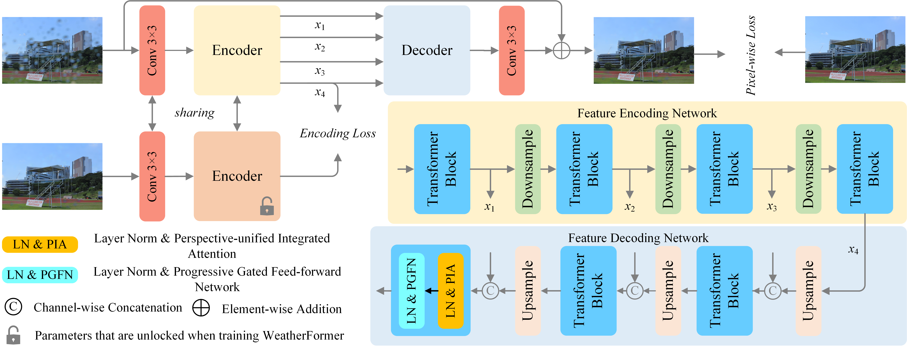
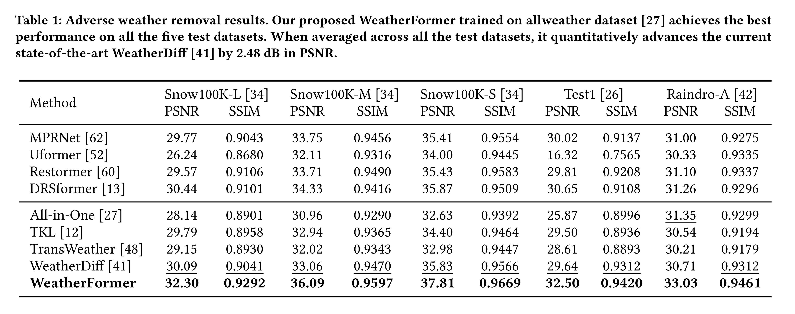

## Beyond Adverse Weather Removal: An Efficient and Transcending Perspective-unified Transformer

**Abstract**: All-in-one restoration of weather-degraded image has been a subject of considerable interest in down-stream computer vision. However, current techniques are deficient in terms of image quality or processing time. To this end, we propose an efficient and transcending perspective-unified Transformer for adverse weather removal, named WeatherFormer. While self-attention mechanisms are frequently employed in image restoration, most fall short in capturing local dependencies and require excessive computational resources. We present a fresh perspective-unified integrated attention (PIA) that incorporates dual sparse permuted self-attention (DSPA) and vision-broad convolution attention (VCA) to improve the feature modeling capabilities. Furthermore, we introduce a progressive gated feed-forward network (PGFN) that employs a multi-field progressive gated mechanism to enhance the non-linear representation. Moreover, most immutable loss functions currently available exhibit inadequate performance when it comes to capturing the distinct characteristics during training process. We propose an unfrozen encoding loss function (UELF), which enforces constraints on the encoder network to generate degradation-independent features, leading to an improvement in the quality of reconstructed image. Extensive experiments derive that WeatherFormer advances WeatherDiff by 2.48 dB, while requiring only 1.92% of its inference time. We provide the source code and pre-trained models in https://github.com/chdwyb/WeatherFormer.



### Requirements

```pyth
python 3.8.6
torch 1.9.0
torchvision 0.11.0
pillow 9.2.0
scikit-image 0.19.3
timm 0.6.7
tqdm 4.64.0
opencv-python 4.5.2.54
```

### Datasets

We trained our proposed WeatherFormer on _allweather_ dataset, which can be downloaded from the link of [Google Drive](https://drive.google.com/file/d/1tfeBnjZX1wIhIFPl6HOzzOKOyo0GdGHl/view) in [TransWeather](https://github.com/jeya-maria-jose/TransWeather). Meanwhile, we tested our model on three synthetic datasets of [Snow100K dataset](https://desnownet.s3.amazonaws.com/dataset_synthetic/test/Snow100K-testset.tar.gz), [Raindrop-A dataset](https://drive.google.com/drive/folders/1e7R76s6vwUJxILOcAsthgDLPSnOrQ49K) and [Test1 dataset](https://www.dropbox.com/sh/zpadllquvmaztib/AACmzqQmGrRMp7qqXjbb7Gfza?dl=0), while four real datasets of [Snow100K-real](https://desnownet.s3.amazonaws.com/realistic_image/realistic.tar.gz), [MPID-rainmist, code: 6h55](https://pan.baidu.com/share/init?surl=lB5jQgGr-5aGuxT5Z8_YmA), [RainDS-rainstreak and RainDS-raindrop](https://drive.google.com/file/d/12yN6avKi4Tkrnqa3sMUmyyf4FET9npOT/view?usp=sharing).

### Train

If you intend to train our proposed WeatherFormer on your own datasets, please follow this.

```python
python train.py --train_data ./allweather/ --val_data ./raindrop_a/ --cuda True
```

### Models

We provide our pre-trained models for comparisons in [WeatherFormer models](https://github.com/chdwyb/pre_trained_models). Please note that the final results of these models may differ slightly from our report, but it does not affect the conclusion.

### Test

If you intend to test you own trained models or our pre-trained models, please follow this.

```python
python test.py --input_dir ./Test1/input/ --result_dir ./Test1/result/ --resume_state ./model_best.pth --cuda True
```

### Scores

When you obtain the restored results, please use this command to calculate the metrical scores.

```python
python calculate_psnr_ssim.py --result_dir ./Test1/result/ --target_dir ./Test1/target/
```



### Contact us

If you have any inquiries or questions regarding our work, please feel free to contact us at [wyb@chd.edu.cn](mailto:wyb@chd.edu.cn).

